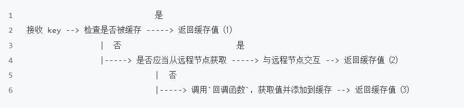
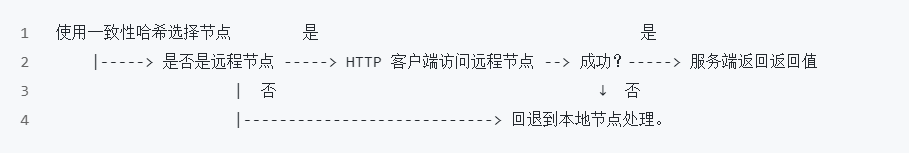

# GeeCacheVIew
This is a project to help you learn go_cache from zero to one

### 目的及目标：

​	本教程是对极客兔兔GeeCache的细致剖析，将作者没有讲解到的设计思想和go语言进阶用法再展开，致力于让仅了解go语言基础的gopher快速上手自己的第一个项目，并从中有所得。项目名GeeCacheView的灵感来自于C++17的string_view类，即 通过代理的思想，通过view而观其貌。

### 项目所学：

​	设计一个分布式缓存系统，考虑资源控制、淘汰策略、并发、分布式节点通信等各个方面的问题。你将能学到

- 单机缓存和基于 HTTP 的分布式缓存
- 最近最少访问(Least Recently Used, LRU) 缓存策略
- 使用 Go 锁机制防止缓存击穿
- 使用一致性哈希选择节点，实现负载均衡
- 使用 protobuf 优化节点间二进制通信
- redis初识


### 一、LRU缓存策略

如果你不了解LRU，可以先做一道LeetCode题：

[146. LRU 缓存 - 力扣（LeetCode）](https://leetcode.cn/problems/lru-cache/)

如果实在不想做也没关系，但你必须了解LRU为最近最少使用缓存淘汰策略，也就意味着，如果缓存满了，再有缓存添加进来，那么弹出的（淘汰的）缓存一定是**距离上次使用时间最久**的缓存。

同时，你还需要看懂这张图


这是LRU的核心数据结构，蓝色部分是一个map，key为缓存的key（string类型），value为缓存结点指针类型。

红色部分是双向链表，我们采用go内置的双向链表list来实现，并规定，head是最久未被使用的缓存，也就是即将淘汰的缓存，而end是新加入或新刷新的缓存，记住就好。

下面来看具体的代码：

```go
package lru

import "container/list"

// Cache is a LRU cache. It is not safe for concurrent access.
type Cache struct {
	maxBytes int64
	nbytes   int64
	ll       *list.List		//用内置的list实现双向链表
	cache    map[string]*list.Element
	// optional and executed when an entry is purged.
	OnEvicted func(key string, value Value)
}

type entry struct {
	key   string
	value Value
}

// Value use Len to count how many bytes it takes
type Value interface {
	Len() int
}
```

- 在这里我们直接使用 Go 语言标准库实现的双向链表`list.List`。

- 字典的定义是 `map[string]*list.Element`，键是字符串，值是双向链表中对应节点的指针。

- `maxBytes` 是允许使用的最大内存，`nbytes` 是当前已使用的内存，`OnEvicted` 是某条记录被移除时的回调函数，可以为 nil。

- 键值对 `entry` 是双向链表节点的数据类型，在链表中仍保存每个值对应的 key 的好处在于，淘汰队首节点时，需要用 key 从字典中删除对应的映射。

- 为了通用性，我们允许值是实现了 `Value` 接口的任意类型，该接口只包含了一个方法 `Len() int`，用于返回值所占用的内存大小。

  

这里就有需要注意的点了，**只要实现了Len（）int的类型，都可以当缓存的值**，而在本项目中使用了*entry来当做value，这在后面类型断言中会再次提到。


```go
func (c *Cache) Get(key string) (value Value, ok bool) {
	if ele, ok := c.cache[key]; ok {
		c.ll.MoveToFront(ele)
		kv := ele.Value.(*entry)  //下文解释
		return kv.value, true
	}
	return
}
```

这是一个查找缓存的函数，查找主要有 2 个步骤，第一步是从字典中找到对应的双向链表的节点，第二步，将该节点移动到队尾。

- 如果键对应的链表节点存在，则将对应节点移动到队尾，并返回查找到的值。

- `c.ll.MoveToFront(ele)`，即将链表中的节点 `ele` 移动到队尾（双向链表作为队列，队首队尾是相对的，在这里约定 front 为队尾）

  

kv := ele.Value.(*entry)， 这一行就体现了上文提到的类型断言，从ele中取出value，然后断言其是 *entry类型，因为后续的插入操作，插入的实际类型就为 *entry，所以一定能断言成功

如果你认为这种类型断言好像多此一举，直接将value设为 *entry不就行了吗，干嘛来回转换，如果你学过面向对象的语言你就会知道，这其实是一种动态的思想，我们往往有这样的设计思想：即 **使用抽象类型，绑定时绑定具体类型**。

如果你理解到这，极客兔兔的go_Lru对于你来说已不是难事，去看一下即可。 为了能引入**go单元测试**的概念，还是建议你先看一下这篇博客：

[Go Test 单元测试简明教程 | 快速入门 | 极客兔兔 (geektutu.com)](https://geektutu.com/post/quick-go-test.html)

eg：LRU缓存策略的应用是非常广泛的，操作系统，MySQL，redis等等，都有它的身影，在缓存淘汰的策略上是一个好选择。

### 二、并发缓存

并发缓存

- sync.Mutex 互斥锁的使用，并实现 LRU 缓存的并发控制。

- 实现 GeeCache 核心数据结构 Group，缓存不存在时，调用回调函数获取源数据

  

​	先简单介绍一下，为什么有了LRU类还需要这样一个cache类，该类是对LRU的进一步封装

```go
type cache struct {
	mu         sync.Mutex
	lru        *lru.Cache		//包含一个LRU
	cacheBytes int64
}
```

同时添加了，安全添加，获取的方法，本质上就是对LRU的添加，获取方法进行外部的加锁操作，使其在并发下操作也是安全的。


再来看这个ByteView类，它的本质就是LRU的缓存值，读到这你可能就有点晕，刚刚在说类型断言的时候，不是说value实际是 *entry吗，没错，而ByteView中的b（b []byte）是entry中的value，也就是说他就是实际的缓存，你不信吗？看他实现了 Len（）方法，**实现了value接口里的方法**，那他可不就能当一个value来用吗。

```go
package geecache

// A ByteView holds an immutable view of bytes.
type ByteView struct {
	b []byte	   //上面有提到我
}

// Len returns the view's length
func (v ByteView) Len() int {				//    看我实现了len方法
	return len(v.b)
}

// ByteSlice returns a copy of the data as a byte slice.
func (v ByteView) ByteSlice() []byte {
	return cloneBytes(v.b)
}

// String returns the data as a string, making a copy if necessary.
func (v ByteView) String() string {
	return string(v.b)
}

func cloneBytes(b []byte) []byte {
	c := make([]byte, len(b))
	copy(c, b)
	return c
}
```


主体结构group：

Group 是 GeeCache 最核心的数据结构，负责与用户的交互，并且控制缓存值存储和获取的流程。

说到这里你可能又晕了，光实现缓存的存取我们已经说了两个类了：LRU和cache，并且明白了 cache就是对LRU加了一层互斥锁而已。可怎么又出来一个group呢？

```go
type Group struct {
	name      string
	getter    Getter		//找不到缓存时，获取缓存的回调函数
	mainCache cache			//包含一个cache
}
```

这样是不是一下就好理解了，其实还是对cache的一层封装，只是group需要面向用户，负责与用户的交互，我们思考一下，如果缓存不存在，应从数据源（文件，数据库等）获取数据并添加到缓存中。GeeCache 是否应该支持多种数据源的配置呢？

不应该，一是数据源的种类太多，没办法一一实现；二是扩展性不好。如何从源头获取数据，应该是用户决定的事情，我们就把这件事交给用户好了。因此，我们设计了一个回调函数(callback)，在缓存不存在时，调用这个函数，得到源数据。

所以这个回调是用户设置的。


这里有一个接口型函数的概念，如下：

```go
// A Getter loads data for a key.
type Getter interface {
	Get(key string) ([]byte, error)
}

// A GetterFunc implements Getter with a function.
type GetterFunc func(key string) ([]byte, error)

// Get implements Getter interface function
func (f GetterFunc) Get(key string) ([]byte, error) {
	return f(key)
}
```

如果你不理解没关系，兔兔为我们详细解答了这个概念

[Go 接口型函数的使用场景 | 极客兔兔 (geektutu.com)](https://geektutu.com/post/7days-golang-q1.html)

如果你看完了还不理解，或者根本不想看，那你只需要举个反例并记住一句话：

你其实可以反过来想一想，如果不提供这个把函数转换为接口的函数，你调用时就需要创建一个struct，然后实现对应的接口，创建一个实例作为参数，相比这种方式就麻烦得多了。

**一句话**：就是为了方便传函数作为参数而已。


```go
var (
	mu     sync.RWMutex
	groups = make(map[string]*Group)
)
```

这是一种全局变量的声明方式。


### 三、http服务器

这一节其实在逻辑上并不难理解，就是为单机搭建一个HTTP server

分布式缓存需要实现节点间通信，建立基于 HTTP 的通信机制是比较常见和简单的做法。

这里仅介绍一些语法上的点：

```go
func (p *HTTPPool) ServeHTTP(w http.ResponseWriter, r *http.Request) {
	if !strings.HasPrefix(r.URL.Path, p.basePath) {
		panic("HTTPPool serving unexpected path: " + r.URL.Path)
	}
	p.Log("%s %s", r.Method, r.URL.Path)
	// /<basepath>/<groupname>/<key> required
	parts := strings.SplitN(r.URL.Path[len(p.basePath):], "/", 2)
	if len(parts) != 2 {
		http.Error(w, "bad request", http.StatusBadRequest)
		return
	}

	groupName := parts[0]
	key := parts[1]
```

parts这一行在初见时都难以理解，你需要提前知道的一点是：

我们**约定**：在请求数据时，按照URL这样的格式请求 “ /<basepath>/<groupname>/<key> ”。

`parts := strings.SplitN(r.URL.Path[len(p.basePath):], "/", 2)` 这一行的作用是将请求的URL路径分割成两部分，并将结果存储在名为 `parts` 的变量中。

具体来说，这行代码的作用如下：

1. `r.URL.Path` 是接收到的HTTP请求的URL路径部分。
2. `p.basePath` 是`HTTPPool`结构体的成员变量，表示URL路径的基础路径。
3. `len(p.basePath)` 返回基础路径的长度。
4. `r.URL.Path[len(p.basePath):]` 通过切片操作，获取除去基础路径后的实际请求路径。
5. `strings.SplitN` 是一个字符串分割函数，用于将字符串按照指定的分隔符进行分割。
6. `"/"` 是分隔符，表示将请求路径按照斜杠进行分割。
7. `2` 是分割的最大次数。这里设置为2，表示最多分割成两部分。
8. `parts` 是存储分割后的结果的变量。

通过这段代码，我们可以得到请求路径的两部分，通常用于解析出 `<groupname>` 和 `<key>`，这些信息可能在后续的处理中起到关键作用。

而`parts` 是一个字符串切片（slice），所以后面能使用 parts【0】这样的语句取出 groupName。


### 四、一致性哈希

一致性哈希是寻址算法中一个比较不错的选择，在redis集群中，我们常常拿hash取余算法，一致性哈希算法，哈希槽算法，来做比较，redis集群采用的是哈希槽，并且redis之父也在github上解释了为什么只用16384个哈希槽，而不是CRC16算法所能得到的最大65535个哈希槽。如果你能看完下面这个教程，相信你对一致性哈希算法也有一个深刻了解，并且揭开redis哈希槽算法的面纱。

[好刚: 7分钟视频详解一致性hash 算法_哔哩哔哩_bilibili](https://www.bilibili.com/video/BV1Hs411j73w/?spm_id_from=333.337.search-card.all.click&vd_source=e7552d13c7ee6abab7a5e8aac2172d8d)

视频中所介绍的使用虚拟节点改进的一致性哈希算法，将在下面实现：

```go
package consistenthash

import (
	"hash/crc32"
	"sort"
	"strconv"
)

// Hash maps bytes to uint32
type Hash func(data []byte) uint32

// Map constains all hashed keys
type Map struct {
	hash     Hash
	replicas int
	keys     []int // Sorted
	hashMap  map[int]string
}

// New creates a Map instance
func New(replicas int, fn Hash) *Map {
	m := &Map{
		replicas: replicas,
		hash:     fn,
		hashMap:  make(map[int]string),
	}
	if m.hash == nil {
		m.hash = crc32.ChecksumIEEE
	}
	return m
}
```

- 定义了函数类型 `Hash`，采取依赖注入的方式，允许用于替换成自定义的 Hash 函数，也方便测试时替换，默认为 `crc32.ChecksumIEEE` 算法。

- `Map` 是一致性哈希算法的主数据结构，包含 4 个成员变量：Hash 函数 `hash`；虚拟节点倍数 `replicas`；哈希环 `keys`；虚拟节点与真实节点的映射表 `hashMap`，键是虚拟节点的哈希值，值是真实节点的名称。

- 构造函数 `New()` 允许自定义虚拟节点倍数和 Hash 函数。

  

只要理解了一致性哈希算法，代码逻辑就很好理解了，下面提一个注意点：

```go
// Get gets the closest item in the hash to the provided key.
func (m *Map) Get(key string) string {
	if len(m.keys) == 0 {
		return ""
	}

	hash := int(m.hash([]byte(key)))
	// Binary search for appropriate replica.
	idx := sort.Search(len(m.keys), func(i int) bool {
		return m.keys[i] >= hash
	})

	return m.hashMap[m.keys[idx%len(m.keys)]]
}
```

`hash := int(m.hash([]byte(key)))` 这一行涉及到类型转换。

首先，`m.hash([]byte(key))` 表示将提供的 `key` 转换为字节数组，然后调用 `m.hash` 方法对字节数组进行哈希计算。

接下来，`int(...)` 将计算得到的哈希值转换为整数类型。这是因为 `m.keys` 切片中存储的是整数类型的哈希值，因此需要将计算得到的哈希值转换为相同的类型，以便进行后续的比较和搜索操作。


`idx := sort.Search(len(m.keys), func(i int) bool { return m.keys[i] >= hash })` 是进行二分搜索的一行代码。

该行使用了 `sort.Search()` 函数来查找满足给定条件的索引。函数的第一个参数是切片的长度，第二个参数是一个函数，用于指定搜索的条件。

也就是说，顺时针找到第一个比他大的那个节点的idx，这个idx就是他该存放到的节点。


### 五、分布式节点

​	首先先搞懂兔兔提供的这两张流程图：






```go
// PeerPicker is the interface that must be implemented to locate
// the peer that owns a specific key.
type PeerPicker interface {
	PickPeer(key string) (peer PeerGetter, ok bool)
}

// PeerGetter is the interface that must be implemented by a peer.
type PeerGetter interface {
	Get(group string, key string) ([]byte, error)
}
```

定义两个接口，从名字可以看出，PeerPicker是用来选择节点的，而PeerGetter是用来从节点获取缓存的，我们后面会让http实现这两个接口，也就等同于使每个节点http有了选择节点、获取缓存的功能。

```go
var _ PeerGetter = (*httpGetter)(nil)

var _ PeerPicker = (*HTTPPool)(nil)
```

特别注意这两行代码，拿第一个来举例：

`var _ PeerGetter = (*httpGetter)(nil)` 是一种语法，用于进行类型断言和接口验证。它的作用是***确保 `httpGetter` 类型实现了 `PeerGetter` 接口***。

在这里，`var _ PeerGetter` 声明了一个变量 `_`，但并不对其进行赋值。`PeerGetter` 是一个接口类型，通过将 `(*httpGetter)(nil)` 赋值给 `_` 变量，实际上是在检查 `httpGetter` 类型是否实现了 `PeerGetter` 接口。

如果 `httpGetter` 类型没有实现 `PeerGetter` 接口的所有方法，编译器将会产生错误，因为无法将 `(*httpGetter)(nil)` 赋值给 `PeerGetter` 类型的变量。

理解了这些，分布式节点就差不多了。


### 六、缓存击穿

> **缓存雪崩**：缓存在同一时刻全部失效，造成瞬时DB请求量大、压力骤增，引起雪崩。缓存雪崩通常因为缓存服务器宕机、缓存的 key 设置了相同的过期时间等引起。

> **缓存击穿**：一个存在的key，在缓存过期的一刻，同时有大量的请求，这些请求都会击穿到 DB ，造成瞬时DB请求量大、压力骤增。

> **缓存穿透**：查询一个不存在的数据，因为不存在则不会写到缓存中，所以每次都会去请求 DB，如果瞬间流量过大，穿透到 DB，导致宕机。

在redis当中也常常提到这些概念，需要注意的是缓存击穿和缓存穿透是**完全不同**的概念，偶尔的缓存穿透是正常的，比如用户要请求的数据在redis（缓存）当中没有，就去后台数据库服务器查，数据库也没有该数据，就造成了一次缓存穿透，如果有人恶意大量请求数据库中没有的数据，就会造成大量的缓存穿透，这样可能会造成数据库宕机，我们可以在redis前面挡一层布隆过滤器。 感兴趣可以去了解一下布隆过滤器。

```go
package singleflight

import "sync"

type call struct {
	wg  sync.WaitGroup
	val interface{}
	err error
}

type Group struct {
	mu sync.Mutex       // protects m
	m  map[string]*call
}
```

singleflight帮助我们实现：就算有大量的请求，去一个节点请求数据，该请求函数也只会被调用一次

```go
func (g *Group) Do(key string, fn func() (interface{}, error)) (interface{}, error) {
	g.mu.Lock()
	if g.m == nil {
		g.m = make(map[string]*call)
	}
	if c, ok := g.m[key]; ok {
		g.mu.Unlock()
		c.wg.Wait()
		return c.val, c.err
	}
	c := new(call)
	c.wg.Add(1)
	g.m[key] = c
	g.mu.Unlock()

	c.val, c.err = fn()
	c.wg.Done()

	g.mu.Lock()
	delete(g.m, key)
	g.mu.Unlock()

	return c.val, c.err
}
```

通过 do方法来做到：

- Do 方法，接收 2 个参数，第一个参数是 `key`，第二个参数是一个函数 `fn`。Do 的作用就是，针对相同的 key，无论 Do 被调用多少次，函数 `fn` 都只会被调用一次，等待 fn 调用结束了，返回返回值或错误。

- `sync.WaitGroup`。

  - wg.Add(1) 锁加1。

  - wg.Wait() 阻塞，直到锁被释放。

  - wg.Done() 锁减1。

    

那么以上教程就结束了，感谢


tag：[7天用Go从零实现ORM框架GeeORM | 极客兔兔 (geektutu.com)](https://geektutu.com/post/geeorm.html)
